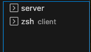

# Phase 4 Project - 'movie+'
This is a movie review application where the user can see the movie trailer while leaving comments (1 per movie)

## Requirements to install and run this program
Acces to a terminal.
Internet browser. 

# Application instructions 
Navigate to the directory from your terminal and `git copy` the repo from GitHub.
Open file (`code .`)
You should end up having 2 terminals open: 1st for phase4-server and the 2nd one change directory into the client folder (`cd client`). (see below)

For the server terminal, please run `rails s` (assuming you already have Rails installed globally.)
For the client terminal, please run `npm install` => `npm start`. After this last command is ran, your browser should open the application or you could run the following [here](http://localhost:4000) 
## Attention: run your server first in order to have the data displayed. ##

After creating an account, you can browse in the list of movies navigation from the Movies button on the Navigation bar. Hovering over the movie poster will display a message of 'See movie details' and once clicked, the individual movie will be rendered on the page containing movie information, the trailer and reviews. 
The reviews are limited for 1 comment per movie. 
Also, the logged in user will not be able to edit or delete another user's review. 
After you left a review to one of the movies, the movie will be automatically added to the User Profile list. Navigating here, you are able to see a list of movies that you have reviewed. Once a review is deleted, the movie is taken out from this list. 
The login session will last until the user logs out. 

Enjoy!

# Controlers 
- Application Controller 
- Movies Controller 
- Reviews Controller 
- Reviews Controller 
- Sessions Controllers 
- Users Controllers 
# Models
- Movie
- Review 
- User 
# Serializers
- Movie Serializer 
- Review Serializer 
- User Serializer 
- User-Movie Serializer 

# Technologies used: 
- API: Ruby on Rails 
- Client-side: React, Boostrap, HTML, CSS, Youtube 

# Resources:
- Layout and design: [React Movie App Tutorial](https://www.freecodecamp.org/news/react-movie-app-tutorial/)
- Youtube addition: [Medium blog post](https://medium.com/@otooker/embedding-a-youtube-video-in-react-9be0040b050d)
- Background image: [Netflix](https://www.netflix.com/)
- Movie information (details, movie posters): [IMDb](https://www.imdb.com/)
- Trailers: [Youtube](https://www.youtube.com/)
- Inspiration: [Indie App](https://github.com/victorzarour/indie-hub-app)